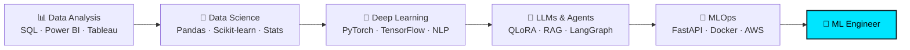

<!-- ═══════════════ HEADER ═══════════════ -->


<div align="center">

<a href="https://git.io/typing-svg">
  
</a>

<br/>


<br/>

[](https://aniket-tayade-nine.vercel.app)
[](https://linkedin.com/in/aniket-g-tayade)
[](mailto:tayadeanni@gmail.com)
[](https://instagram.com/the_real_tayade_aniket)

</div>

---

## 👨‍💻 About Me

```python
class AniketTayade:
    def __init__(self):
        self.role        = "Machine Learning Engineer (in the making) | Data Scientist"
        self.experience  = "1.5+ years in Data Science, Analytics & Teaching"
        self.works_at    = "NextHike IT Solutions"
        self.studying    = "M.Sc. Computer Science @ MIT ACSC, Pune (CGPA 9.07)"
        self.location    = "Pune, Maharashtra, India 🇮🇳"
        self.focus       = ["LLM Fine-Tuning", "Federated Learning", "Agentic AI / RAG", "MLOps"]
        self.research    = "Presented FedTune @ INSIGHT 2026 (Track I: Intelligent Systems, AI/ML)"
        self.open_to     = ["ML Engineer roles", "Research collabs", "Open-source AI projects"]

    def philosophy(self):
        return "Models are only useful when they ship. Data is only useful when it drives decisions."
```

I'm a **Data Scientist evolving into a Machine Learning Engineer** — I've spent 1.5+ years turning raw data into insights, dashboards and predictive models, and I'm now going deeper into **building, fine-tuning, deploying and scaling** ML/LLM systems end-to-end. My work sits at the intersection of **analytics rigor** and **ML engineering craft**.

<table>
<tr>
<td width="50%" valign="top">

### 🔭 What I'm Working On
- 🔒 **FedTune**: privacy-preserving LLM personalization via federated QLoRA
- 🤖 **FINRA-AI**: multi-agent financial research system (LangGraph + RAG)
- 🧱 Productionizing ML with **FastAPI, Docker & AWS**
- ✍️ Documenting my journey in a build-in-public series on LinkedIn

</td>
<td width="50%" valign="top">

### 🎯 What Drives Me
- 🧠 Building intelligent systems that solve real business problems
- 📈 Data storytelling: insights people can actually act on
- 🛠️ Clean, reproducible, deployable ML code
- 🌍 Working on impactful problems with global teams

</td>
</tr>
</table>

---

## 💼 Experience

| Role | Where | What I Do |
|:--|:--|:--|
| 🧪 **Junior Data Scientist** <br/>_(1.5+ yrs)_ | **NextHike IT Solutions** | End-to-end data workflows: data cleaning & EDA, feature engineering, predictive modeling, BI dashboards (Power BI / Tableau), and stakeholder-ready insights |
| 👨‍🏫 **Python & Data Analytics Instructor** | Training / Teaching | Taught Python, data analysis and visualization; simplified complex ML/stat concepts for learners |
| 🌐 **Web Development Mentor** | Mentorship | Guided learners through building and deploying real web projects |

<sub>**Analyst → Scientist → ML Engineer:** the full data lifecycle is in my toolbox — from SQL and dashboards to model training, deployment and monitoring.</sub>

---

## 🛠️ Tech Arsenal

<div align="center">

### 🤖 Machine Learning & Deep Learning


`Hugging Face` &nbsp; `PEFT / QLoRA` &nbsp; `Keras` &nbsp; `XGBoost` &nbsp; `SHAP` &nbsp; `ONNX` &nbsp; `MediaPipe` &nbsp; `OpenCV` &nbsp; `NLP`

### 🧠 LLMs, Agents & Federated Learning
`LangChain` &nbsp; `LangGraph` &nbsp; `RAG` &nbsp; `Qdrant` &nbsp; `Flower (FL)` &nbsp; `Model Context Protocol (MCP)` &nbsp; `Prompt Engineering` &nbsp; `Mistral OCR`

### ⚙️ MLOps, Backend & Cloud


### 📊 Data Analytics & Visualization


`Matplotlib` &nbsp; `Seaborn` &nbsp; `Plotly` &nbsp; `Statistics` &nbsp; `A/B Testing` &nbsp; `Business Analytics`

### 🗄️ Databases, Big Data & Frontend


</div>

---

## 🚀 Featured Projects

<table>
<tr>
<td width="50%" valign="top">

### 🔒 [FedTune](https://github.com/tayade-aniket/FedTune)
**Privacy-Preserving On-Device LLM Personalization via Federated QLoRA**

Fine-tune LLMs across decentralized clients without sharing raw data, using parameter-efficient QLoRA adapters and federated aggregation.


🏆 _Presented at **INSIGHT 2026** · Track I: Intelligent Systems (AI/ML)_

</td>
<td width="50%" valign="top">

### 🤖 [FINRA-AI](https://github.com/tayade-aniket/FINRA-AI)
**Full-Stack Multi-Agent Financial Research System**

Specialized agents collaborate via LangGraph, retrieving and reasoning over financial documents with RAG to produce research-grade answers.


</td>
</tr>
<tr>
<td width="50%" valign="top">

### 📉 [Customer Churn Analytics](https://github.com/tayade-aniket/Customer-Churn-Analytics)
**Predict, Explain & Serve Churn Risk**

End-to-end pipeline: EDA → XGBoost modeling → **SHAP** explainability → **FastAPI** inference service → **Docker** deployment.


</td>
<td width="50%" valign="top">

### ✍️ [Air Doodle](https://github.com/tayade-aniket/Air-Doodle)
**Draw in the Air with Hand Gestures**

Real-time gesture-based drawing using computer vision: track your hand, pinch to draw, wave to erase.


</td>
</tr>
</table>

<div align="center">

[](https://github.com/tayade-aniket?tab=repositories)

</div>

---

## 📊 GitHub Analytics

<div align="center">


</div>

<details>
<summary>🐍 <b>Contribution snake</b> (click to see setup)</summary>

<br/>

Add this workflow at `.github/workflows/snake.yml` in your profile repo, then uncomment the image below:

```yaml
name: Generate Snake
on:
  schedule: [{ cron: "0 0 * * *" }]
  workflow_dispatch:
jobs:
  generate:
    runs-on: ubuntu-latest
    permissions: { contents: write }
    steps:
      - uses: Platane/snk/svg-only@v3
        with:
          github_user_name: ${{ github.repository_owner }}
          outputs: dist/github-snake.svg?palette=github-dark
      - uses: crazy-max/ghaction-github-pages@v3.1.0
        with: { target_branch: output, build_dir: dist }
        env: { GITHUB_TOKEN: "${{ secrets.GITHUB_TOKEN }}" }
```

```html
<!--  -->
```

</details>

---

## 🏅 Certifications & Learning

<div align="center">

-D97757?style=for-the-badge&logo=anthropic&logoColor=white)


</div>

🎓 **Education:** M.Sc. Computer Science, MIT Arts, Commerce & Science College, Pune (CGPA **9.07**) · B.Voc. Software Development (CGPA 7.60)

---

## 🧭 Roadmap: Data Scientist → ML Engineer



---

## 🤝 Let's Collaborate

- 🤖 Machine Learning, LLM & Agentic-AI projects
- 🔒 Federated learning & privacy-preserving AI research
- 📊 Dashboards, Business Intelligence & analytics
- 🌱 Open-source data science & ML contributions

> 💬 _Ask me about:_ **LLM fine-tuning, RAG pipelines, multi-agent systems, model explainability, or breaking into ML from data analytics.**

<div align="center">

<br/>

📫 **[tayadeanni@gmail.com](mailto:tayadeanni@gmail.com)** &nbsp;•&nbsp; 🌐 **[aniket-tayade-nine.vercel.app](https://aniket-tayade-nine.vercel.app)**

<sub>😄 **Fun fact:** I like turning messy datasets into clean dashboards, and clean notebooks into deployed models.</sub>

<br/>


</div>


