<!-- ═══════════════ HEADER ═══════════════ -->


<div align="center">

<a href="https://git.io/typing-svg">
  
</a>

<a href="https://git.io/typing-svg">
  
</a>

<br/>


<br/>

[](https://aniket-tayade-nine.vercel.app)
[](https://linkedin.com/in/aniket-g-tayade)
[](mailto:tayadeanni@gmail.com)
[](https://instagram.com/the_real_tayade_aniket)

<br/>

**[About](#-about-me) &nbsp;•&nbsp; [Experience](#-experience) &nbsp;•&nbsp; [Education](#-education) &nbsp;•&nbsp; [Tech Arsenal](#%EF%B8%8F-tech-arsenal) &nbsp;•&nbsp; [Projects](#-featured-projects) &nbsp;•&nbsp; [Analytics](#-github-analytics) &nbsp;•&nbsp; [Certifications](#-certifications--learning) &nbsp;•&nbsp; [Contact](#-lets-collaborate)**

</div>


## 👨‍💻 About Me

```python
class AniketTayade:
    def __init__(self):
        self.role        = "Machine Learning Engineer (in the making) | Data Scientist"
        self.experience  = "1+ year in Data Science, Analytics & Teaching"
        self.works_at    = "NextHike IT Solutions"
        self.studying    = "M.Sc. Computer Science @ MIT ACSC, Pune (CGPA 9.07)"
        self.location    = "Pune, Maharashtra, India 🇮🇳"
        self.focus       = ["LLM Fine-Tuning", "Federated Learning", "Agentic AI / RAG", "MLOps"]
        self.research    = "Presented FedTune @ INSIGHT 2026 (Track I: Intelligent Systems, AI/ML)"
        self.open_to     = ["ML Engineer roles", "Research collabs", "Open-source AI projects"]

    def philosophy(self):
        return "Models are only useful when they ship. Data is only useful when it drives decisions."
```

I'm a **Data Scientist evolving into a Machine Learning Engineer**. I've spent over a year turning raw data into insights, dashboards and predictive models, and I'm now going deeper into **building, fine-tuning, deploying and scaling** ML/LLM systems end-to-end. My work sits at the intersection of **analytics rigor** and **ML engineering craft**.

<table>
<tr>
<td width="50%" valign="top">

### 🔭 What I'm Working On
- 🔒 **FedTune**: privacy-preserving LLM personalization via federated QLoRA
- 🤖 **FINRA-AI**: multi-agent financial research system (LangGraph + RAG)
- 🧱 Productionizing ML with **FastAPI, Docker & AWS**
- ✍️ Documenting my journey in a build-in-public series on LinkedIn

</td>
<td width="50%" valign="top">

### 🎯 What Drives Me
- 🧠 Building intelligent systems that solve real business problems
- 📈 Data storytelling: insights people can actually act on
- 🛠️ Clean, reproducible, deployable ML code
- 🌍 Working on impactful problems with global teams

</td>
</tr>
</table>

<div align="right"><a href="#top">⬆ back to top</a></div>

---

## 💼 Experience

| Role | Where | What I Do |
|:--|:--|:--|
| 🧪 **Junior Data Scientist Intern** <br/>_(1 year)_ | **NextHike IT Solutions** | End-to-end data workflows: data cleaning & EDA, feature engineering, predictive modeling, BI dashboards (Power BI / Tableau), and stakeholder-ready insights |
| 👨‍🏫 **Python & Data Analytics Instructor** | Training / Teaching | Taught Python, data analysis and visualization; simplified complex ML/stat concepts for learners |
| 🌐 **Web Development Mentor** | Mentorship | Guided learners through building and deploying real web projects |

<sub>**Analyst → Scientist → ML Engineer:** the full data lifecycle is in my toolbox, from SQL and dashboards to model training, deployment and monitoring.</sub>

---

## 🎓 Education

| Degree | Institution | Score |
|:--|:--|:--:|
| 🎓 **M.Sc. Computer Science** _(Pursuing)_ | MIT Arts, Commerce & Science College (MIT ACSC), Pune |  |
| 🎓 **B.Voc. Software Development** | Sant Gadge Baba Amravati University |  |

---

## 🛠️ Tech Arsenal

<div align="center">

### 🤖 Machine Learning & Deep Learning


### 🧠 LLMs, Agents & Federated Learning


-FF6F00?style=for-the-badge)


### ⚙️ MLOps, Backend & Cloud


### 📊 Data Analytics & Visualization


### 🗄️ Databases, Big Data & Frontend


</div>

<div align="right"><a href="#top">⬆ back to top</a></div>

---

## 🚀 Featured Projects

<!-- Update the tech badges / descriptions of each project below to match your actual stack -->

<table>
<tr>
<td width="50%" valign="top">

### 🚦 [Indian Road Accident Severity](https://github.com/tayade-aniket/indian_road_accident_severity)
**Predicting & Understanding Accident Severity on Indian Roads**

End-to-end ML project: data cleaning, EDA and modeling to predict how severe a road accident is, surfacing the factors that matter most for road safety.


</td>
<td width="50%" valign="top">

### ✈️ [Airline AI Decision Platform](https://github.com/tayade-aniket/airline-ai-decision-platform)
**AI-Powered Decision Support for Airline Operations**

A platform that turns airline data into actionable, data-driven decisions using machine learning and AI.


</td>
</tr>
<tr>
<td width="50%" valign="top">

### 🏠 [Airbnb Search Ranking System](https://github.com/tayade-aniket/airbnb_search_ranking_system)
**Ranking Listings by Relevance for Better Search**

A search-ranking system that orders listings so the most relevant results surface first, built with a machine-learning ranking approach.


</td>
<td width="50%" valign="top">

### ⛽ [Flight Fuel Optimization Assistant](https://github.com/tayade-aniket/flight_fuel_optimization_assistant)
**AI Assistant for Smarter Flight Fuel Planning**

An intelligent assistant that helps analyze and optimize flight fuel usage to cut cost and improve efficiency.


</td>
</tr>
</table>

<div align="center">

[](https://github.com/tayade-aniket?tab=repositories)

</div>

---

## 📊 GitHub Analytics

<div align="center">


</div>

<details>
<summary>🐍 <b>Contribution snake</b> (click to see setup)</summary>

<br/>

Add this workflow at `.github/workflows/snake.yml` in your profile repo, then uncomment the image below:

```yaml
name: Generate Snake
on:
  schedule: [{ cron: "0 0 * * *" }]
  workflow_dispatch:
jobs:
  generate:
    runs-on: ubuntu-latest
    permissions: { contents: write }
    steps:
      - uses: Platane/snk/svg-only@v3
        with:
          github_user_name: ${{ github.repository_owner }}
          outputs: dist/github-snake.svg?palette=github-dark
      - uses: crazy-max/ghaction-github-pages@v3.1.0
        with: { target_branch: output, build_dir: dist }
        env: { GITHUB_TOKEN: "${{ secrets.GITHUB_TOKEN }}" }
```

```html
<!--  -->
```

</details>

---

## 🏅 Certifications & Learning

<div align="center">

-D97757?style=for-the-badge&logo=anthropic&logoColor=white)


</div>

---

## 🧭 Roadmap: Data Scientist → ML Engineer

```mermaid
flowchart LR
    A[📊 Data Analysis<br/>SQL · Power BI · Tableau] --> B[🧪 Data Science<br/>Pandas · Scikit-learn · Stats]
    B --> C[🧠 Deep Learning<br/>PyTorch · TensorFlow · NLP]
    C --> D[🤖 LLMs & Agents<br/>QLoRA · RAG · LangGraph]
    D --> E[🚀 MLOps<br/>FastAPI · Docker · AWS]
    E --> F[🎯 ML Engineer]
    style A fill:#1E3A8A,color:#fff,stroke:#2563EB
    style B fill:#2563EB,color:#fff,stroke:#1E3A8A
    style C fill:#8B5CF6,color:#fff,stroke:#5B21B6
    style D fill:#7C3AED,color:#fff,stroke:#5B21B6
    style E fill:#EA580C,color:#fff,stroke:#9A3412
    style F fill:#F97316,color:#000,stroke:#1E3A8A,stroke-width:3px
```



---

## 🤝 Let's Collaborate

- 🤖 Machine Learning, LLM & Agentic-AI projects
- 🔒 Federated learning & privacy-preserving AI research
- 📊 Dashboards, Business Intelligence & analytics
- 🌱 Open-source data science & ML contributions

> 💬 _Ask me about:_ **LLM fine-tuning, RAG pipelines, multi-agent systems, model explainability, or breaking into ML from data analytics.**

<div align="center">

<br/>

📫 **[tayadeanni@gmail.com](mailto:tayadeanni@gmail.com)** &nbsp;•&nbsp; 🌐 **[aniket-tayade-nine.vercel.app](https://aniket-tayade-nine.vercel.app)**

<sub>😄 **Fun fact:** I like turning messy datasets into clean dashboards, and clean notebooks into deployed models.</sub>

<br/>


</div>


